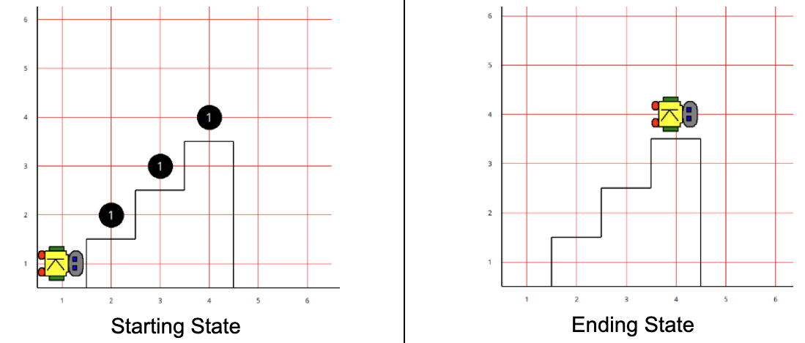

# Building Your Own Robot Class

Sometimes the built-in commands aren't enough on their own — you want Karel to do something more specific, like draw a shape or climb a staircase, and you want to do it more than once without retyping the same moves every time. Instead of writing the same sequence of commands over and over, you can teach Karel a new trick by creating your **own** robot class with your **own** methods.

## Why make your own robot class?

- **Reuse** — define an action once, use it as many times as you want.
- **Readability** — `sweeper.sweepStair()` reads a lot better than five lines of `move()`/`turnLeft()`/`pickBeeper()`.
- **Organization** — break a big problem down into small, clearly-named pieces instead of one long list of moves.

---

## Defining a new robot class

For the rest of this page, we'll build up a `StairSweeper` — a robot that climbs a staircase, picking up the beeper waiting on every step.



**Example:**

```python
from karel.robota import *

class StairSweeper(UrRobot):
    pass
```

This creates a new *kind* of robot, `StairSweeper`, that can do everything `UrRobot` can do (`move()`, `turnLeft()`, `pickBeeper()`, `putBeeper()`), plus anything you add to it.

## Adding your own method

There's no built-in `turnRight()` — only `turnLeft()` — so writing your own is one of the most common first methods anybody adds:

**Example:**

```python
class StairSweeper(UrRobot):
    def turnRight(self):
        self.turnLeft()
        self.turnLeft()
        self.turnLeft()

    def sweepStair(self):
        self.move()
        self.turnLeft()
        self.move()
        self.turnRight()
        self.pickBeeper()
```

- `def` starts a new method definition.
- `self` refers to "this robot" — the specific robot instance the method gets called on. Every method you write needs `self` as its first parameter.
- Inside the method, use `self.move()`, `self.turnLeft()`, etc. — the same commands as before, just written with `self.` instead of a robot's name, since the method doesn't know what the robot will actually be named when it's used.
- Notice that `sweepStair()` calls `self.turnRight()` — a method defined right above it, on the same class. Once you've written a method, you can use it just like any built-in one, including inside your *other* methods.

## Using your new robot

**Example:**

```python
if __name__ == "__main__":
    sweeper = StairSweeper(1, 1, East, 0)
    sweeper.sweepStair()
```

Just like `UrRobot`, you give it a starting street, avenue, direction, and beeper count. Once it exists, you can call your new method on it just like any built-in one.

> ### A closer look at `self`
>
> In `__main__`, when you write `alice = StairSweeper(1, 1, East, 0)`, you're creating one particular robot and giving it the name `alice`. If a method inside your class referred to `bob` directly — like `bob.turnLeft()` — it could only ever act on a robot actually named `bob`.
>
> That's a problem, because a class definition isn't really about one specific robot — it's more like a **blueprint**. You write the class once, and the blueprint can then be used to construct as many different robots as you want, each with its own name. A method needs a way to refer to "whichever robot I should act on right now," not a name hardcoded to one particular robot.
>
> Watch what happens if a method carelessly refers to a hardcoded name instead of `self`:
>
> ```python
> class StairSweeper(UrRobot):
>     def turnRight(self):
>         bob.turnLeft()   # BUG: this refers to a specific robot named "bob"
>         bob.turnLeft()
>         bob.turnLeft()
>
> if __name__ == "__main__":
>     alice = StairSweeper(1, 1, East, 0)
>     alice.turnRight()
> ```
>
> This program never creates a robot named `bob` — it creates one named `alice`. So `alice.turnRight()` breaks: the method tries to act on `bob`, and no robot named `bob` exists anywhere in this program. The fix is `self.turnLeft()` — `self` always refers to whichever robot the method is actually being called on, no matter what that robot happens to be named in a particular program.
>
> One last thing: **`self` is just a convention**, not a Python keyword. You could technically name that first parameter something else (`this`, `me`, `robot`) and it would still work, as long as you used that same name consistently throughout the method. But every Python programmer uses `self` — so should you. Using anything else will only confuse anyone reading your code later, including future you.

---

## Stepwise refinement: a StairSweeper example

Let's use this to build something a bit bigger: a robot that sweeps a **whole** staircase, picking up the beeper sitting on every step, not just one.


Karel starts at the bottom of the staircase facing East, carrying no beepers. Each step has exactly one beeper waiting on it. By the end, Karel should be standing on the top step, facing the same direction it started in, having picked up every beeper along the way.

### Start with the big picture

Before writing a single `move()`, think about what sweeping a staircase actually involves: sweeping one stair, over and over. Write that idea down as a method — even before you know exactly how `sweepStair()` will work internally:

**Example:**

```python
class StairSweeper(UrRobot):
    def sweepStairs(self):
        self.sweepStair()
        self.sweepStair()
        self.sweepStair()

    def sweepStair(self):
        pass  # figure this out next
```

This is **stepwise refinement**: start with a method that describes the big picture in terms of smaller pieces, even if those smaller pieces aren't written yet. `sweepStairs()` is easy to read and review right now — anyone can tell what it's supposed to do — even though `sweepStair()` is still just a placeholder.

### Refine `sweepStair()`

Now fill in the one small piece: what does it actually take to sweep a single stair? Say each stair is one corner forward, then one corner up, with a beeper waiting at the top:

**Example:**

```python
def sweepStair(self):
    self.move()         # walk onto the step
    self.turnLeft()
    self.move()          # step up onto it
    self.turnRight()     # face forward again
    self.pickBeeper()    # pick up the beeper on this step
```

### Put it all together

**Example:**

```python
from karel.robota import *

class StairSweeper(UrRobot):
    def turnRight(self):
        self.turnLeft()
        self.turnLeft()
        self.turnLeft()

    def sweepStairs(self):
        self.sweepStair()
        self.sweepStair()
        self.sweepStair()

    def sweepStair(self):
        self.move()
        self.turnLeft()
        self.move()
        self.turnRight()
        self.pickBeeper()


world.setSize(6, 6)
world.setDelay(30)

sweeper = StairSweeper(1, 1, East, 0)
sweeper.sweepStairs()
```

### Why bother refining instead of writing it all at once?

- `sweepStairs()` is easy to read at a glance — you don't have to trace every `move()` to know what it does.
- If the staircase pattern changes later (say, each step is two corners tall instead of one), you only fix `sweepStair()` — `sweepStairs()` doesn't change at all.
- It's easier to check your work: you can test that `sweepStair()` alone works correctly on a single step before worrying about the whole staircase.

This is the same idea behind **top-down design**: describe the big problem first, in terms of smaller sub-problems, and then solve each sub-problem on its own.
